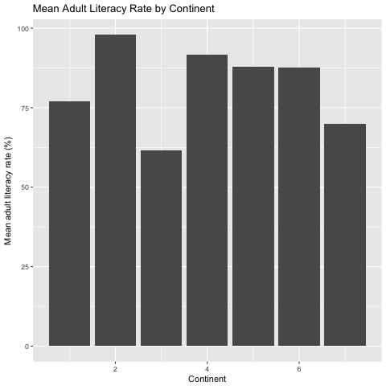

## Reproducible research in public health with Jupyter notebooks

Reproducible and replicable research refer to a process of research where researchers share transparent and reliable work processes online or through other means so that their work can be both repeated and replicated by others. As epidemiologic research is increasingly focussed on identifying risk factors that are small in magnitude and therefore has many confounding variables that need to be adjusted for, and as increasing amount of data are now made available in the public domain for independent researchers and analysts to verify and test the validity of earlier research, reproducibility of \cite{Peng2006} suggest that for public health, reproducibility should be a minimum criterion. They suggest: 

> The reproducibility of epidemiologic findings from current and future studies will be crucial to providing the substance for informed debate regarding policies affecting the public's health


Using Schwab et.al. (2000) recommendations of reproducibility of research in the context of computer science, they suggest the following for public health interventions:

| Component | Requirement |
|-----------|-------------|
| Data      | Available   |
| Methods   | Data set (raw and analytical), computer code, and steps are made available to enable execution |
| Documentation | the documentation of the data set, and the codes will enable replication |
| Distribution | The codes, software, and the documentation must be made available to others |

\cite{Schwab2000}. 

While raw data can be complex and for researchers, it'd be necessary only to work on a subset of the raw data to enable replication of the results. Hence Peng and Zeger suggest that at the least, the analytical data set should be made available to the other researchers. In their study on the extent to which observational epidemiological studies were also reproducible, Peng and Zeger conducted an analysis of the published literature of observational epidemiological studies and found that in their selection of 90 studies published in 2005, none (0/90) had codes for statistical procedures were made available; further, 43/69 (62.3%) did not report the methods used for processing the data they used for analysis. They found that 93% of the articles did not report how the measured data were processed, and therefore one could not replicate the results with new data. 

## The rise of literate programming & the need for free, open source software in reproducible research

In a data-driven discipline such as Epidemiology, the way to practice reproducible research depends on how well the analysts share data and the steps involved in accessing the raw and processed data and also the details of how the methods were conducted to preprocess the data as well as analysed data, and the models and how the models were conducted. This needs three inter-related issues to be resolved: first, we need an approach where data and code are best woven together and the stories that result from this interleave are then disseminated to the wider scientific community to test and verify. We need this to make things simple so that other researchers can keep the issue of data analysis in context; we need software to be freely and openly accessible for examination: we need this so that the underlying assumptions in the analytics can be tested. Freedom here suggests not only that the user of our information do not pay for the services ('free as in free beer') but also, the freedom to study and modify the code where needed \cite{Perens1999}. 

Donald Knuth (1984) coinded the term 'literate programming' to indicate a style of computer code writing where software documentation and the procedures and codes were written together \cite{Knuth1984}. By combining codes and context, meaning, and annotation of the written code to solve a particular problem or address an analytical task, the authors provide both a context and help others to replicate the findings within a meaningful context. Layered on this is the question of whether such processes are available for everyone freely and openly. Here, web provides a level playing ground where others can use the power of a web based solution to replicate these findings using distiributed resource. Perez and Granger (2015) call this combination of data, code, and narrative as "computational narrative"; an app, [Jupyter](http://jupyter.org/) provides an instantiation of how this can be achieved where it is possible to write code and narrative not only in plain text but also weave in codes and text and produce the output in the format of a text document. Jupyter notebooks are digital notebooks that can be used to weave codes, and literate programming in python, julia, and R, and can be used to distribute codes and text \cite{Perens1999}. 

The world wide web has played an important role in the creation and distribution of knowledge. Collaborative resarch writing can be conducted using [Google docs](http://docs.google.com), or [Overleaf](http://www.overleaf.com), and [Authorea](http://www.authorea.com). In each case, it is possible to bring in diverse groups of authors to collaborate on the same platform to write a paper. Using jupyter notebooks and hosting them in [github](http://github.com) and then in binder, it is also possible to set up a web based system where one can analyse and write a paper on the same platform. Converting a jupyter notebook to a standard article format that can be presented on a journal is possible through first converting the notebook to a markdown format and then converting the markdown format to a journal article format. Jupyter notebooks provide the mechanism to convert a notebook to a markdown format and the software [pandoc](http://pandoc.org) provides the tools to convert a markdown document with an associated bibtex file to be converted to a journal article format that can then be put out either in the form of a pdf document, or a word document that most journals would accept for publishing. The original data set and the jupyter notebook can be shared using github with the rest of the world. Preprint servers offer opportunities to host papers before printable format for publishing to draw in comments from the community. In this way, it is possible to harness digital tools that will allow one to collect data, clean, and analyse data, and share the process of the data analysis and insights rapidly with a group of people. 

## Method

Here, we provide an instance of a workflow using jupyter notebook, github, and Authorea to analyse a data set and write a paper based on the data set as a demonstration of what can be done in a setting such as this.  can live in the github repo and the text of a paper can live in Authorea where this can be pushed to Authorea through the jupyter notebook and a bibtex file can be built and worked around. 

The following steps will connect  to be done:

1. First, set up an Authorea file using [Authorea](https://www.authorea.com)
2. Next, connect the Authorea article to [github](https://www.github.com)
3. Now clone the git repo on your local computer
4. Assuming that you have Jupyter installed, you can start a jupyter notebook in the same folder
5. Work on the jupyter notebook for the analyses
6. Convert the notebook to markdown but with the following features: for tables, you can either use markdown tables or convert the data tables to csv files, and save the graphs separately as png files 
7. Now convert the ipynb file into markdown file
8. Modify the layout.md file & add the name of the jupyter notebook markdownified file there
9. Now add, commit, and push the files to github

Once in Authorea, do as follows:

1. Upload the tables as csv files
2. Upload the images
3. From directly within the editor of Authorea, adjust the citations to meet the standards of the journal
4. The text can either be edited from within Authorea or within Jupyter and pushed to Authorea as markdown files
5. Markdown tables are left as is.

Sharable jupyter notebooks can also be shared by [Binder.org](http://www.binder.org) and the article distributed using Authorea or [PeerJ](https://peerj.com) or F1000. The data can be stored in [figshare](https://figshare.com), or in github itself. 


## Results: an exploratory data analysis using this method

The results of this process is a description of the flow of work we have conducted in the process. We have already created an article in [Authorea]() We have implemented the workflow we described in the above steps in the steps where we integrate literate programming below. We will read the data set, then we will conduct preprocessing of the data, and we will save the resulting tables in the folder and we will use them in the final processing in Authorea. We will also use Authorea to store the data in the form of csv file, and the analyses in the form of ipynb file for sharing. Additionally, we will share the data through figshare and the notebook through binder for anyone to reproduce and work on the findings.  


```R
## Load the packages as needed
library(tidyverse)
library(knitr)
library(DiagrammeR)

## these three libaries are needed for constructing diagrams, conducting research in a particular 
# way, etc

## read the data
mydata <- read_csv("WHO.csv", na = "")
# to find out the variables loaded with the data set, 
#names(mydata)
# to find out the structure of the data set
# str(mydata) # 202 observations of 358 variables
# Let's create a short version of the data set with first 12 variables
```


```R
mydatar <- mydata[, c(1:12)]
# structure of mydatar?
#str(mydatar) # 202 observations of 12 variables
# variable names

## rename the variables

mydatar1 <- mydatar %>%
 rename(afr = `Adolescent fertility rate (%)`) %>%
 rename(alr = `Adult literacy rate (%)`) %>%
 rename(gni_percap = `Gross national income per capita (PPP international $)`) %>%
 rename(psenrol_f = `Net primary school enrolment ratio female (%)`) %>%
 rename(psenrol_m = `Net primary school enrolment ratio male (%)`) %>%
 rename(totpop = `Population (in thousands) total` ) %>%
 rename(urbanpop = `Population in urban areas (%)`) %>%
 rename(pop_agr = `Population annual growth rate (%)`) %>%
 rename(pop_below_pov = `Population living below the poverty line (% living on &lt; US$1 per day)`)
 

## Let's summarise the information by continent

sum_mydata <- mydatar1 %>%
 group_by(Continent) %>%
 summarize(mean_afr = mean(afr, na.rm = T),
          mean_alr = mean(alr, na.rm = T),
          mean_gnipercap = mean(gni_percap, na.rm = T),
          mean_psenrol_f = mean(psenrol_f, na.rm = T),
          mean_pbp = mean(pop_below_pov, na.rm = T))

## this has returned a data set with these five variables

## the summarised data can be presented in the form of a table 

kable(sum_mydata)
```


    
    
    | Continent|  mean_afr| mean_alr| mean_gnipercap| mean_psenrol_f|  mean_pbp|
    |---------:|---------:|--------:|--------------:|--------------:|---------:|
    |         1|  37.30000| 76.90000|      14893.529|       85.78947|  2.366667|
    |         2|  20.50000| 97.91154|      19777.083|       92.91111|  2.590909|
    |         3| 111.64444| 61.69048|       3050.435|       67.57447| 35.837500|
    |         4|  49.60000| 91.60000|      24524.000|       95.00000|  3.000000|
    |         5|  77.88889| 87.94091|       7397.143|       89.13793| 14.044444|
    |         6|  39.26087| 87.60714|      12167.200|       89.04000| 12.420000|
    |         7|  57.33333| 69.81250|       2865.556|       85.44444| 28.314286|


```R
## The summarised data can be graphically explored using ggplot
# We plot the mean adult literacy rate by continent
# We can store this figure using a png file format

png("alr_cont.png")
ggplot(sum_mydata) +
 geom_bar(aes(x = Continent, y = mean_alr), stat = "identity") +
 ggtitle("Mean Adult Literacy Rate by Continent") +
 ylab("Mean adult literacy rate (%)") +
 xlab("Continent")
dev.off() 
```


<strong>pdf:</strong> 2


Figure 1. Mean Adult Literacy Rate by Continent


## Discussion

We presented here a simple example of how to interweave data, codes and narrative to annotate the text that can be used for generating insights into public health. In literate programming, Donald Knuth (1984) his idea of weaving a 'story' of ideas and codes (cite knuth1984). In this paper, we have shown that public health professionals can scrape or obtain or data from public data depository such as maintained by the World Health organisation webpage, then clean and preprocess the data using python, R, or Julia for developing graphs and tables to clean the data and explore the data. In our simple example, we have provided the data source in a github repository that anyone can access; we have also provided sample codes and a live notebook that anyone can download and modify or use on his or her own, and examine and modify. We have thus openly and freely distributed our data analysis source code and the source code of writing the paper. [Authorea](https://www.authorea.com) provides a medium where one can write and present ideas.

In this paper, we have used Authorea and Jupyter notebooks to do reproducible research using R for statistical computing and pandoc as document converter. Such a workflow is also possible with other open source tools. Yihui Xie (2014) wrote the package "knitr" (xie2014). Using an accompanying software [Rstudio](http://www.rstudio.com), it is possible to output reproducible research in different formats including "gitbook", or standard journal article formats. A similar approach using Rnotebooks would be to create an Rnotebook with codes and data woven and then uploaded to specific journal sites and data & text can be distributed. [Overleaf](http://www.overleaf.com) provides a latex authoring and hosting environment where research can be distributed. 

Preprints provide an opportunity for wider dissemination of an author's work while the research waits for formal peer review and publication in journals that distribute the work. Preprint servers that can host public health related analyses may include [PeerJ preprint system](http://www.peerj.com), or [F1000](http://www.f1000.com). 


```R
! ls
```


    Error in !ls: invalid argument type
    Traceback:


